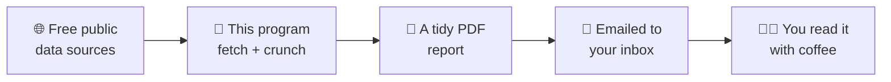
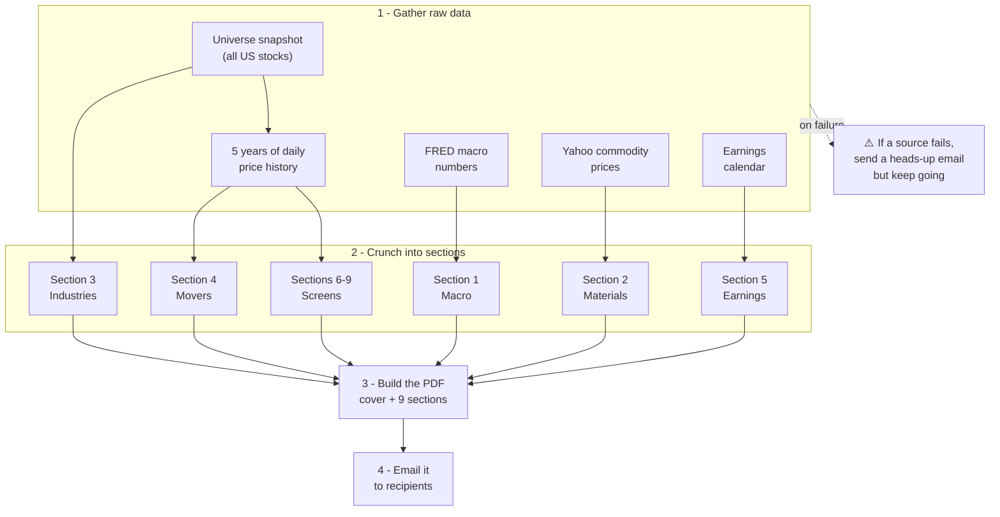
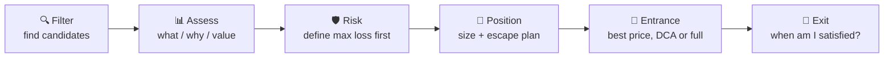
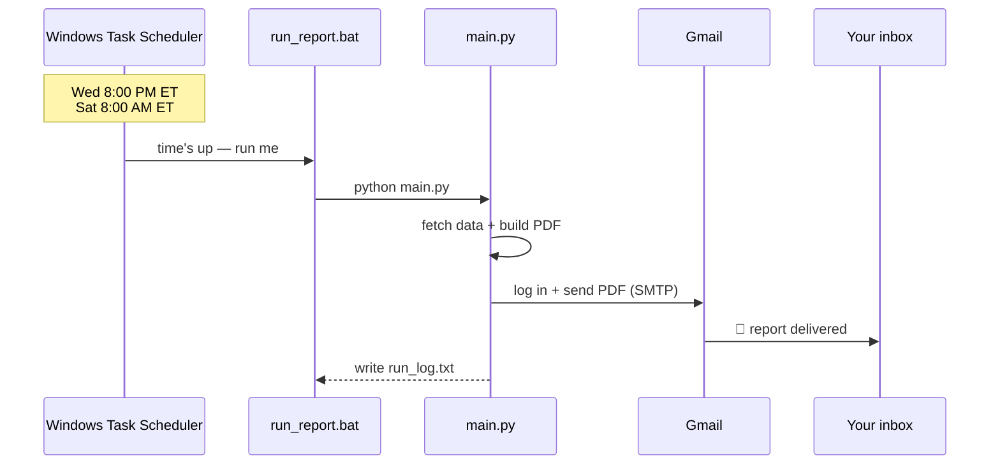

# 📈 Daily Stock Market Report

**A robot that reads the markets for you every few days, writes up a tidy PDF, and emails it to your inbox — automatically.**

You don't open ten websites, copy numbers into a spreadsheet, and try to spot what's moving. This program does all of that on a schedule, packages it into a clean multi-page PDF, and sends it to whoever you choose. It also keeps your own trading discipline (a mantra + a list of past mistakes) on the front page, so every report opens with a reminder to trade sensibly.

> ⚠️ **Not financial advice.** This is a personal research and discipline tool. It surfaces data and lists candidates to *look into* — it does not tell you what to buy or sell.

---

## 🧠 What it actually does (in plain English)

Imagine you hired a very fast intern. Every Wednesday evening and Saturday morning, the intern:

1. **Gathers data** from a few free, public sources (the US Federal Reserve, Yahoo Finance, and a stock screener website).
2. **Crunches it** — figures out what the economy is doing, which commodities and industries are moving, which companies jumped or dropped a lot, who's reporting earnings soon, and which stocks are sitting near important price levels.
3. **Writes a report** — a polished PDF with a cover page, your trading mantra, and nine sections of tables.
4. **Emails it** to your chosen recipients, with the PDF attached.

That's the whole thing. You just read the email.



---

## 📑 What's inside the report

Every report opens with a **cover page** showing your **Sound Options Trading Mantra** and your **past mistakes**, then a detailed **Trading Discipline** page, followed by nine data sections:

| # | Section | In plain English | Where the data comes from |
|---|---------|------------------|---------------------------|
| — | **Cover + Discipline** | Your mantra and past-mistake tickers, front and center | Your own `config.py` + `mistakes.txt` |
| 1 | **Macro Data** | The big-picture health of the economy — interest rates, inflation, jobs, money supply, the "Buffett Indicator" | FRED (the US Federal Reserve's free data service) |
| 2 | **Base Materials & Commodities** | Prices of oil, gold, copper, wheat, etc. — the raw stuff the economy runs on | Yahoo Finance |
| 3 | **Industries** | Which industry groups are heating up or cooling down | A stock-screener website (StockAnalysis) |
| 4 | **Companies of Interest** | Stocks that moved a lot recently (big 5-day movers, big 1-month movers, unusual trading volume) | Computed from price history |
| 5 | **Earnings Calendar** | Which big companies report their results in the next few days | Nasdaq calendar (with a backup source) |
| 6 | **Long-Term Winners Pulling Back** | Strong stocks that have dipped — possible "buy the dip" candidates that also have options | Computed |
| 7 | **Uptrend Pullback** | Stocks trending up but currently resting | Computed |
| 8 | **Downtrend Bounce** | Falling stocks showing a short-term bounce | Computed |
| 9 | **Near 50 / 200-Day Average** | Stocks sitting near key "moving average" price lines traders watch | Computed |

> 💡 **Jargon, decoded:**
> - **Ticker** — a stock's short code (e.g. `GOOG` = Google/Alphabet).
> - **FRED** — Federal Reserve Economic Data, a free government website with thousands of economic numbers.
> - **Moving average** — the average price over the last N days; a smoothed line traders use to gauge trend.
> - **Options** — contracts that let you bet on a stock's direction with limited cost (see Section 6).

---

## ⚙️ How it works under the hood

The program builds the report in stages. Each stage is wrapped in a safety net: if one data source is down, that section is left blank (or uses a backup), and the rest of the report is still produced and sent. **One failure never sinks the whole report.**



**The orchestrator** is `main.py` — it calls each piece in order, catches errors, and hands the finished data to the PDF builder and then the email sender.

---

## 🧭 The trading discipline (your mantra)

The whole point of putting this on the **front page** is behavioral: every time you open a report, you re-read your own rules *before* you look at any exciting mover. The mantra is six steps:



Underneath sits your **Past Mistakes** list — tickers you've been burned by before (`CAR, UNH, FVI, TNZ, BTE, MDA, AEO, LULU, GOOG`) — a standing reminder of lessons already paid for. Edit these any time in [`mistakes.txt`](mistakes.txt) (one ticker per line) and the mantra/definitions in [`config.py`](config.py).

---

## 🚀 Getting started

### Prerequisites
- **Python 3.10+** installed.
- A **free FRED API key** — get one in 30 seconds at <https://fred.stlouisfed.org/docs/api/api_key.html>.
- A **Gmail account** to send from, with an **App Password** (see below).

### 1. Install the dependencies
```bash
pip install -r requirements.txt
```

### 2. Create your `.env` file
Copy the template and fill in your own values. **This file holds your secrets and is never uploaded to GitHub** (it's listed in `.gitignore`).
```bash
cp .env.example .env
```
Then edit `.env`:
```ini
FRED_API_KEY=your_fred_api_key_here
STOCKANALYSIS_API_KEY=                 # optional — leave blank to use the free fallback
EMAIL_RECIPIENT=alice@example.com,bob@example.com   # comma-separated for multiple people
EMAIL_SENDER=youremail@gmail.com
EMAIL_APP_PASSWORD=your_16_char_app_password
```

### 3. Get a Gmail App Password (free, 2 minutes)
A normal Gmail password won't work for apps. You create a special 16-character "App Password":
1. Turn on **2-Step Verification** on your Google account.
2. Go to <https://myaccount.google.com/apppasswords>.
3. Create a password (pick "Mail"), and paste the 16 characters into `EMAIL_APP_PASSWORD`.

---

## ▶️ Running it

| Command | What it does |
|---------|--------------|
| `python main.py` | Build the report **now** and email it. |
| `python main.py --no-email` | Build the report now, **just save the PDF** (no email) — great for testing. |
| `python main.py --schedule` | Run forever as a background "daemon" that sends on the built-in schedule. |

The finished PDF is saved as `stock_report.pdf` in the project folder.

---

## ⏰ Automating it (the schedule)

There are two ways to make it run on its own. **On Windows, the recommended way is the built-in Task Scheduler** (it survives reboots and doesn't need a terminal left open).

A small wrapper, [`run_report.bat`](run_report.bat), is what Windows runs — it changes into the project folder, runs `python main.py`, and logs the result to `run_log.txt`.



**Current schedule:** Wednesday **8:00 PM** and Saturday **8:00 AM** (US Eastern Time), via a task named `StockReport_Weekly`.

To change *when* it runs, edit the Windows task (search "Task Scheduler" → find `StockReport_Weekly`). To change the schedule used by the `--schedule` daemon mode instead, edit `SEND_SCHEDULE` in `config.py`:
```python
SEND_SCHEDULE = [("wednesday", "20:00"), ("saturday", "08:00")]  # (day, "HH:MM") Eastern
```

---

## 🗂️ Project structure

```text
stock_report/
├── main.py                 # 🎬 Orchestrator — runs everything in order
├── config.py               # ⚙️ All settings: data lists, mantra, schedule (reads secrets from .env)
├── .env                     # 🔒 Your private keys + recipients (NOT in git)
├── .env.example             # 📋 Template to copy
│
├── universe.py             # Snapshot of all US stocks (the master list)
├── price_history.py        # Downloads 5y of daily prices, cached once per day
├── screens.py              # Pure math: the Section 6-9 "screens" (no internet)
│
├── section1_macro.py       # Section 1: FRED economic data
├── section2_materials.py   # Section 2: commodity prices
├── section3_industries.py  # Section 3: industry trends
├── section4_companies.py   # Section 4: big movers + volume spikes
├── section5_earnings.py    # Section 5: upcoming earnings
│
├── pdf_builder.py          # 🖨️ Lays out the cover, mantra, and all tables into a PDF
├── email_sender.py         # 📧 Sends the PDF via Gmail (and failure alerts)
├── helpers.py              # Small shared utilities
│
├── mistakes.txt            # ✍️ Your past-mistake tickers (edit freely)
├── run_report.bat          # 🪟 What Windows Task Scheduler runs
├── requirements.txt        # 📦 Python dependencies
└── tests/                  # ✅ Automated tests (pytest)
```

---

## 🛡️ Built-in resilience

This isn't a fragile script — it's designed to keep working unattended:

- **Graceful degradation** — if the stock universe source is down, it falls back to the S&P 500 list; each section is wrapped so one failure can't abort the report.
- **Failure alerts** — if a data source fails or the email can't send, you get a short heads-up email so you're never silently in the dark.
- **Daily price cache** — price history is downloaded once per day and reused, so repeated runs are fast and gentle on the data providers.
- **No-double-send guard** — the daemon scheduler won't fire the same slot twice.

---

## ❓ Troubleshooting

| Symptom | Likely fix |
|---------|-----------|
| "Authentication failed" in the log | You're using your normal Gmail password — switch to a **Gmail App Password**. |
| No email arrived | Check `EMAIL_RECIPIENT`, `EMAIL_SENDER`, `EMAIL_APP_PASSWORD` in `.env`; check `run_log.txt`. |
| Sections are blank | A data source was temporarily down — the next run usually fills them back in. |
| Scheduled task never ran | Open Task Scheduler, confirm `StockReport_Weekly` is **Enabled** and points to `run_report.bat`. |
| Want to test without spamming people | Run `python main.py --no-email` and open `stock_report.pdf`. |

---

## 🧪 Tech & tests

Built in **Python** with `fredapi`, `yfinance`, `pandas`, `fpdf2` (PDF), `beautifulsoup4` (web parsing), and `smtplib` (email). Run the test suite with:
```bash
pytest -q
```

---

*Personal project. Data is provided by third parties "as is" and may be delayed or incomplete. Always verify before acting on anything. Nothing here is financial advice.*
